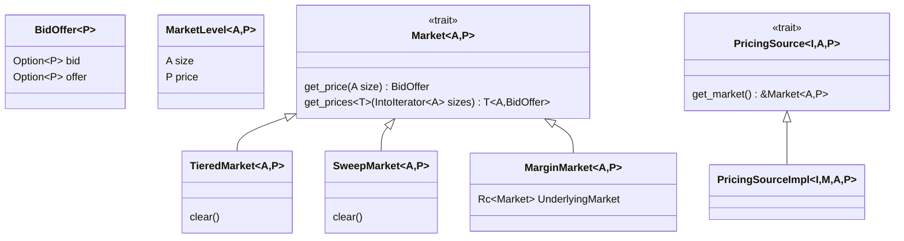

# pricing
A rust based pricing library 

```mermaid
classDiagram
    class BidOffer~P~ {
        Option~P~ bid
        Option~P~ offer
    }

    class MarketLevel~A,P~ {
        A size
        P price
    }

    class Market~A,P~ {
        <<trait>>
        get_price(A size) BidOffer
        get_prices~T~(IntoIterator~A~ sizes) T~A,BidOffer~
    }

    class TieredMarket~A,P~ {
        clear()
    }
    Market <|-- TieredMarket

    class SweepMarket~A,P~ {
        clear()
    }
    Market <|-- SweepMarket

    class MarginMarket~A,P~ {
        Rc~Market~ UnderlyingMarket
    }
    Market <|-- MarginMarket

    class PricingSource~I,A,P~ {
        <<trait>>
        get_market() &Market~A,P~
    }

    class PricingSourceImpl~I,M,A,P~ {
        
    }
    PricingSource <|-- PricingSourceImpl

```
